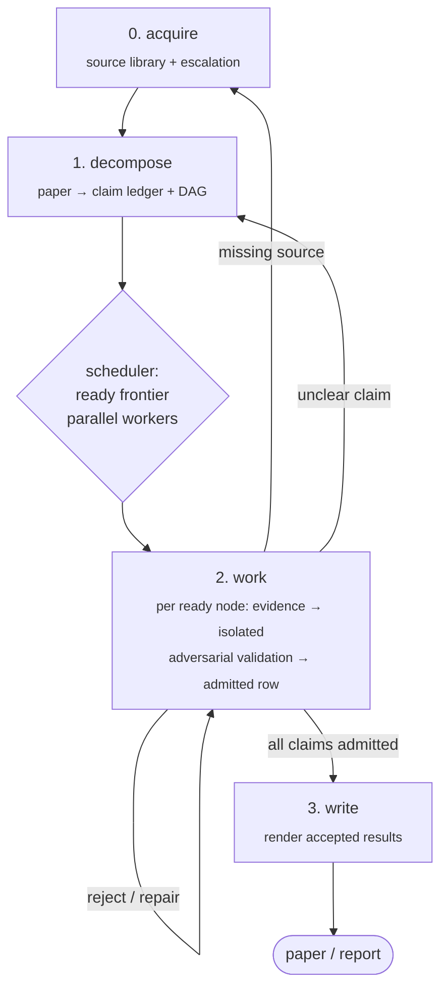

# Chandra

**Closed-loop, agent-driven scientific research: the agent proposes; the verifier admits.**

[](LICENSE)
[](#requirements)
[](#requirements)

Chandra is a methodology and runtime for running LLM agents on long-horizon
theoretical-research missions — parsing papers, deriving results, writing and
running code, transferring theorems, drafting a paper — under one
non-negotiable invariant:

```text
The agent proposes; the verifier admits.
```

Nothing an agent *says* counts as progress. Results, claims, and DAG nodes
enter research memory only through append-only, hash-chained ledgers whose
admission gate is **executable code, not prose**: verification commands are
run at append time (exit 0 required, observed outcome recorded on the row),
evidence files are content-hashed, cited dependencies must resolve, and a
`solid` node must rest on `solid` predecessors. Prose artifacts —
`results.md`, `claims.md`, the paper itself — are rendered views over the
ledgers, never hand-authored.

## How it works

A mission decomposes a source paper into a DAG of claims, then works the DAG
to closure:



The orchestrator (`orchestrator/`, TypeScript on the
[Claude Agent SDK](https://www.npmjs.com/package/@anthropic-ai/claude-agent-sdk))
drives the loop, and every discipline it imposes is enforced in code:

- **Parallel waves** — the scheduler computes the ready frontier (all
  predecessors solid, obligations discharged) and leases each worker a
  *packet*: a chain of nodes worked continuously in one session. Adaptive
  packet sizing grows and shrinks the work quantum from telemetry.
- **Ledger-diff outcomes** — a worker's outcome (admitted / promoted /
  rejected / failed / no-progress) is computed from the ledger diff, never
  from the agent's own report.
- **Process-isolated adversarial validation** — a refuter session runs in a
  directory containing *only* the allowlisted context pack (kernel, admission
  contract, claim, candidate evidence) and must attempt rejection before a
  judge may admit. Isolation is physical, not a "do not look" instruction.
- **Delegation policy** — under `.delegation-policy: strict`, ledger appends
  require a delegated role (`CHANDRA_ROLE` ∈ worker / validator / observer);
  the orchestrating session cannot append its own work. `human-override` is
  the visible escape hatch, recorded on the row.
- **Observer memory** — a dedicated agent maintains a three-note hierarchy
  (iteration / nodal / research state) after every wave; the long-memory note
  is hard-capped at 10 KB and mechanically pruned (history stays in git).
- **Circuit breaker** — component-wise progress counters over verified
  statuses only; a stalled mission halts and asks for a human instead of
  burning budget.
- **Human channel** — a digest every 5 completed context windows,
  `progress/<mission>/PAUSE` for graceful halt, `STEER.md` for free-text
  guidance injected into the next wave, and a self-contained HTML mission
  dashboard (KPIs, the DAG with per-node drill-down, all four ledgers)
  rendered straight from the ledgers.
- **Tamper evidence** — every wave lands as a commit (gated by the tracked
  commit-message hook), and a broken ledger hash chain halts the mission
  cold.

## Repository layout

```
alignment.md   always-on ~2.4 KB agent kernel (§0–§6; do not grow)
INDEX.md       canonical index + workflow contract (wins over all other docs)
pipelines/     stage contracts: 0-acquire, 1-decompose, 2-work, 3-write
_common/       contracts, hash-chained ledgers + executable admission gate,
               loop gate, DAG renderer + HTML mission dashboard, git hooks
orchestrator/  TypeScript runtime: scheduler, workers, validators, observer,
               digest cadence
notes/         mission-state templates
tests/         pytest suite for the Python infrastructure
.claude/       session-start kernel injection + subagent stop reminder
```

Research itself happens in *consumer repos* that adopt this methodology. A
consumer repo holds exactly three research trees:

```
results/                  canonical outputs: ledgers, rendered views,
                          per-paper decomposition/tasks/codes/plots/paper
progress/<mission>/       committed memory: the three notes + human digest
ref-paper/, ref-code/     gitignored local source mirrors with provenance
```

Agent diaries (journal, worker scratch, debug artifacts) live outside the
repo in `/tmp/chandra/<repo>-<hash>/` (override with `CHANDRA_RUNTIME`).

## Getting started

### Requirements

- **Python ≥ 3.10** — the ledger and loop infrastructure has no third-party
  dependencies (`pytest` only, for the test suite).
- **Node ≥ 18** — for the orchestrator (TypeScript, built with `tsc`).
- **Anthropic API access** — real (non-dry-run) missions spawn Claude Agent
  SDK sessions.

### Install and self-check

```bash
git clone <this-repo> && cd Chandra
python3 -m pytest                    # Python infra self-checks
bash _common/hooks/install.sh        # activate the commit-message gate

cd orchestrator
npm install && npm test              # build + behavioral suite
```

### Run a mission

In a consumer repo (a git repo seeded with this methodology — clone or vendor
it, copy `.claude/`, install the hooks):

1. Create `mission.json` at the repo root:

   ```json
   {
     "paper": "2501.01234",
     "maxWorkers": 4,
     "maxWaves": 100,
     "packetSize": 4,
     "digestThreshold": 5
   }
   ```

   Optional `models` maps per-role model overrides (`worker`, `refuter`,
   `judge`, `observer`, `jobs`); set the refuter to a *different* model for
   cross-model refutation.

2. Mirror the target paper under `ref-paper/arxiv-<id>/` with a
   `PROVENANCE.md` (stage 0 does this for you on a fresh start).

3. Plan and run:

   ```bash
   cd orchestrator
   npm run plan -- --repo-root <consumer-repo>              # ready frontier, no side effects
   npm run run-mission -- --repo-root <consumer-repo>       # execute waves
   npm run run-mission -- --repo-root <consumer-repo> --dry-run
   ```

4. Steer while it runs: drop `progress/<mission>/PAUSE` to halt gracefully,
   write `progress/<mission>/STEER.md` to inject guidance into the next wave,
   and read `HUMAN_DIGEST.md` for the paced status report.

## Command reference

```bash
python3 -m pytest                                         # infra self-checks
python _common/result_database.py render-md --paper P     # generated results.md
python _common/result_database.py render-state --paper P  # research-state block
python _common/claims_database.py render-md --paper P --out-dir DIR
python _common/visualization/dashboard.py render --paper P # self-contained HTML mission dashboard
python _common/visualization/dag_mermaid.py merge         # one merged Mermaid DAG
python _common/visualization/dag_mermaid.py progress --paper P
python _common/loop_policy.py crash-triage --paper P --task T
python _common/loop_gate.py status                        # circuit-breaker verdict
```

## Documentation

The documentation is deliberately minimal; each file below is the single
source of truth for its area.

| Document | Role |
|---|---|
| [`INDEX.md`](INDEX.md) | Canonical file index and workflow contract — wins when any doc disagrees |
| [`alignment.md`](alignment.md) | The always-on agent kernel (§0 verifier admits · §1 fact-driven · §2 no tweak-loops · §3 stall→acquire · §4 source discipline · §5 context injection · §6 delegation-only) |
| [`pipelines/*/spec.md`](pipelines/) | Per-stage contracts: role, I/O, verifier gates, anti-patterns |
| [`_common/README.md`](_common/README.md) | Shared infrastructure: ledgers, admission gate, loop controls, renderers |
| [`orchestrator/README.md`](orchestrator/README.md) | Runtime: build, run, and module map |
| [`_common/contracts/`](_common/contracts/) | Admission contract, status markers, note discipline, commit-message grammar |
| [`_common/hooks/README.md`](_common/hooks/README.md) | The enforced commit-message gate |
| [`notes/multi_timescale_tracking_template.md`](notes/multi_timescale_tracking_template.md) | The three-note memory hierarchy |
| [`tests/README.md`](tests/README.md) | Test coverage map |

## Contributing

- Run both suites before submitting: `python3 -m pytest` and
  `cd orchestrator && npm test`.
- Install the commit gate (`bash _common/hooks/install.sh`); commit titles
  follow `_common/contracts/commit_template.md` and non-conforming titles are
  rejected.
- `alignment.md` is capped at ~2.5 KB by design — rules whose enforcement is
  mechanical belong in code, with the kernel only pointing at them.
- Ledger schema changes require matching rejection tests in `tests/`.

## License

[MIT](LICENSE) © 2026 Hai-Yang Wang, California Institute of Technology.
